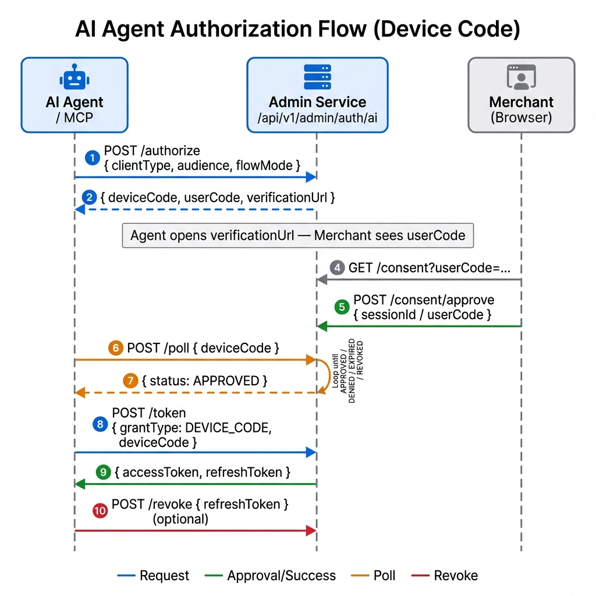

<p align="center">
  
</p>

<h1 align="center"><a href="https://fusionx.fun/">FusionXPay</a></h1>

<p align="center">
  <strong>AI-native Java microservices payment platform — MCP Server, AI CLI, gateway routing, multi-provider payment processing, event-driven notifications, and built-in observability.</strong>
</p>

<p align="center">
  
  
  
  
  
  
  
</p>

---

## Overview

FusionXPay is an **AI-native** payment platform built with Spring Cloud microservices. Beyond standard payment processing (Stripe and PayPal), webhook-driven status updates, refunds, and async notifications, FusionXPay ships with a full AI integration layer:

- **MCP Server** — Exposes payment and order tools via the Model Context Protocol, allowing AI agents (e.g., Claude, Cursor) to query orders, initiate payments, and trigger refunds with AOP-enforced safety guards.
- **AI CLI** — A picocli-based command-line interface for AI agents and automation pipelines to interact with FusionXPay programmatically.
- **AI Auth** — An OAuth2-inspired browser-based consent flow that lets AI agents acquire scoped tokens for authorized API access.
- **Platform Audit** — API Gateway emits ingress audit events to Kafka (`platform-audit-log` topic) for every external request, while CLI/MCP attach `X-Audit-*` metadata for source/action attribution.

---

## Architecture

<p align="center">
  
</p>

### Services

| Service | Port | What it does |
|---------|------|--------------|
| API Gateway | 8080 | Routes requests, enforces JWT Bearer auth, Redis-backed rate limiting, emits platform audit events |
| Order Service | 8082 | Order lifecycle, merchant-scoped data isolation |
| Payment Service | 8081 | Provider integration (Stripe/PayPal), webhook handling, refunds |
| Notification Service | 8083 | Kafka-driven async notification delivery |
| Admin Service | 8084 | JWT-authenticated admin/merchant management and AI auth sessions |

### AI Layer

| Component | What it does |
|-----------|--------------|
| MCP Server | Exposes FusionXPay tools via Model Context Protocol; AOP safety pipeline guards all invocations |
| AI CLI | picocli-based CLI for AI agents to authenticate, query orders/payments, and trigger actions |
| AI Common | Shared DTOs for AI auth flows (authorize, poll, consent, token exchange, revoke) |

### Infrastructure

| Component | Purpose |
|-----------|---------|
| MySQL | Persistence for all services |
| Redis | Rate limiting (gateway) and caching/idempotency (payment) |
| Kafka | Event bus — `payment-events` (payment→order), `order-events` (order→notification), `platform-audit-log` (gateway ingress audit) |
| Eureka | Service discovery |
| Prometheus + Grafana + Loki | Metrics, dashboards, and centralized log aggregation |

---

## AI Integration

### MCP Server

The MCP Server (`ai/ai-mcp-server`) implements the [Model Context Protocol](https://modelcontextprotocol.io/) so that AI agents can interact with FusionXPay as a native tool provider.

**Available tools** (via `FusionXMcpTools`):

| Tool | Description |
|------|--------------|
| `get_order` | Retrieve full order details by order ID or order number |
| `get_order_status` | Get only the status projection for an order |
| `search_orders` | Search merchant orders with optional status, order number, and date filters |
| `query_payment` | Query a payment by transaction ID or order ID |
| `search_payments` | Search merchant payments with optional status and date filters |
| `initiate_payment` | Prepare a payment request — returns `CONFIRMATION_REQUIRED`; must be followed by `confirm_action` |
| `refund_payment` | Prepare a refund request — returns `CONFIRMATION_REQUIRED`; must be followed by `confirm_action` |
| `confirm_action` | Execute a previously prepared write action using its confirmation token |

**AOP Safety Pipeline** — every tool call passes through three aspects in sequence:

```
InputSafetyAspect → ToolAuditAspect → OutputSafetyAspect
```

- `InputSafetyAspect` — validates and sanitizes tool inputs before execution
- `ToolAuditAspect` — attaches MCP audit metadata (`X-Audit-*`) to downstream gateway-bound requests
- `OutputSafetyAspect` — redacts or prevents sensitive data from leaking to the AI agent

### AI CLI

The AI CLI (`ai/ai-cli`) is a **picocli**-based Spring Boot application that AI agents or automated pipelines can invoke from the command line.

**Available command groups:**

| Command | Description |
|---------|-------------|
| `auth login` | Start the browser-based AI consent flow |
| `auth status` | Check current authentication status |
| `auth logout` | Revoke the current AI token |
| `order get <id>` | Get an order by ID |
| `order status <id>` | Get an order's current status |
| `order search` | Search orders |
| `payment pay` | Initiate a payment |
| `payment confirm` | Confirm a pending payment |
| `payment refund` | Refund a payment |
| `payment query` | Query payment details |
| `payment search` | Search payments |

### AI Auth Flow

AI agents obtain scoped access tokens through a browser-based consent flow managed by Admin Service (`POST /api/v1/admin/auth/ai/*`). The flow mode depends on the client:

- **CLI** — attempts a **callback flow** first (PKCE + local HTTP server on `127.0.0.1` to receive the redirect); if that fails (e.g., no browser or port conflict), it falls back to the **device-code flow** where the user visits a verification URL manually.
- **MCP** — uses the **device-code flow** directly, since MCP clients run headlessly without a local callback server.

Both flows share a two-phase poll-then-token exchange: poll returns only a status, and the token is obtained in a separate `POST /token` call once the status is `APPROVED`.

<p align="center">
  
</p>

> **API base path:** `http://localhost:8080/api/v1/admin/auth/ai/{endpoint}` (via API Gateway on port 8080; browser approval uses `GET /consent`, token/session operations use `POST`)

### Platform Audit

Every external request that crosses API Gateway is recorded to Kafka and can be persisted to MySQL through Kafka Connect:

**MCP Server path:** `ToolAuditAspect` (AOP) → injects `X-Audit-Source=MCP-Java`, tool action name, and a correlation ID into each gateway request

**CLI path:** `CliExecutionStrategy` (picocli execution hook) → injects `X-Audit-Source=CLI-Java`, command action name, and a correlation ID into each gateway request

Both paths converge at:
1. `GatewayAuditFilter` emits a `PlatformAuditEvent` to the `platform-audit-log` topic for every inbound request
2. Kafka Connect JDBC Sink persists events to the `platform_audit_log` table
3. Source/action attribution remains consistent across CLI, MCP, and future SDK clients through the shared `X-Audit-*` contract

---

## Quick Start

### Prerequisites

| Requirement | Version |
|-------------|---------|
| Java | 21+ |
| Maven | 3.6+ |
| Docker | 20.10+ |
| Docker Compose | 2.0+ |

### Setup

```bash
git clone https://github.com/Manho/FusionXPay.git
cd FusionXPay
cp .env.always-on.example .env.always-on
```

Edit `.env.always-on` with your infrastructure hosts, database credentials, payment provider keys, and callback URLs.

### Start Everything

```bash
docker compose -f docker-compose.always-on.yml --env-file .env.always-on up -d --build
```

### Verify

```bash
./scripts/check-always-on-health.sh ./.env.always-on
./scripts/verify-service-chain.sh
```

### Useful Endpoints

| Endpoint | Purpose |
|----------|---------|
| `http://localhost:8080/actuator/health` | Gateway health |
| `http://localhost:8080/api/v1/admin/auth/ai/authorize` | AI Agent auth entry point (via gateway) |
| `http://localhost:3001` | Grafana dashboards |
| `http://localhost:9090` | Prometheus |
| `http://localhost:3100` | Loki log query |

---

## Docker Compose Profiles

| File | Use case |
|------|----------|
| `docker-compose.yml` | Local development — infrastructure only (MySQL, Redis, Kafka, Eureka) |
| `docker-compose.prod.yml` | Production image builds |
| `docker-compose.always-on.yml` | Long-running deployment with health checks and resource limits |
| `docker-compose.monitoring.yml` | Observability stack (Prometheus, Grafana, Loki, Promtail) |

---

## Testing

```bash
# Unit tests
mvn test

# Integration tests (Testcontainers spins up MySQL, Redis, Kafka)
mvn verify -pl services/api-gateway

# Service-specific tests
mvn test -pl services/payment-service
mvn test -pl services/admin-service
mvn test -pl ai/ai-mcp-server
mvn test -pl ai/ai-cli

# Runtime verification (requires running stack)
./scripts/check-always-on-health.sh ./.env.always-on
./scripts/verify-service-chain.sh

# End-to-end payment flows (sandbox keys required)
./scripts/e2e-payment-refund.sh stripe
./scripts/e2e-payment-refund.sh paypal
```

---

## Project Structure

```text
FusionXPay/
├── services/
│   ├── api-gateway/           # Spring Cloud Gateway, rate limiting, auth routing, platform audit emission
│   ├── order-service/         # Order lifecycle and merchant isolation
│   ├── payment-service/       # Provider integration, webhooks, refunds
│   ├── notification-service/  # Kafka-driven notifications
│   └── admin-service/         # Admin/merchant APIs and AI auth sessions
├── ai/
│   ├── ai-mcp-server/         # Model Context Protocol server with AOP safety pipeline
│   ├── ai-cli/                # picocli-based CLI for AI agent interactions
│   └── ai-common/             # Shared DTOs for AI auth flows
├── common/                    # Shared DTOs and utilities
├── mysql-init/                # Database initialization scripts
├── scripts/                   # Deploy, verify, backup, rollback, E2E utilities
├── monitoring/                # Prometheus, Grafana, Loki, Promtail configs
├── docs/                      # Architecture, deployment, platform audit, and testing docs
└── .github/workflows/         # CI, Docker build, and deployment pipelines
```

---

## Documentation

| Document | Purpose |
|----------|---------|
| [Architecture](./docs/design/architecture.md) | System structure and service responsibilities |
| [Platform Audit Sink](./docs/deployment/platform-audit-sink.md) | Kafka Connect setup for persisting `platform-audit-log` into MySQL |
| [Process Flow](./docs/design/process-flow.md) | Payment flow diagrams and sequence explanations |
| [Requirements](./docs/requirements/requirements.md) | Product and API requirements |
| [Testing Strategy](./docs/testing/testing-strategy.md) | Test layers and coverage approach |
| [Performance Baseline](./docs/testing/performance-baseline-report.md) | k6 load test results |
| [Reliability Report](./docs/testing/reliability-test-report.md) | Recovery and resilience findings |
| [Operations Runbook](./docs/operations/local-observability-backup.md) | Monitoring, backup, and local ops |
| [Always-On Deployment](./docs/deployment/local-always-on.md) | Long-running deployment setup |
| [Auto Deploy](./docs/deployment/auto-deploy-main.md) | CI/CD deployment automation |

---

## Related

| Project | Description |
|---------|-------------|
| [FusionXPay Frontend](https://github.com/Manho/fusionxpay-web) | Next.js dashboard, landing page, and docs UI |

---

## License

This project is licensed under the MIT License. See [LICENSE](./LICENSE) for details.
