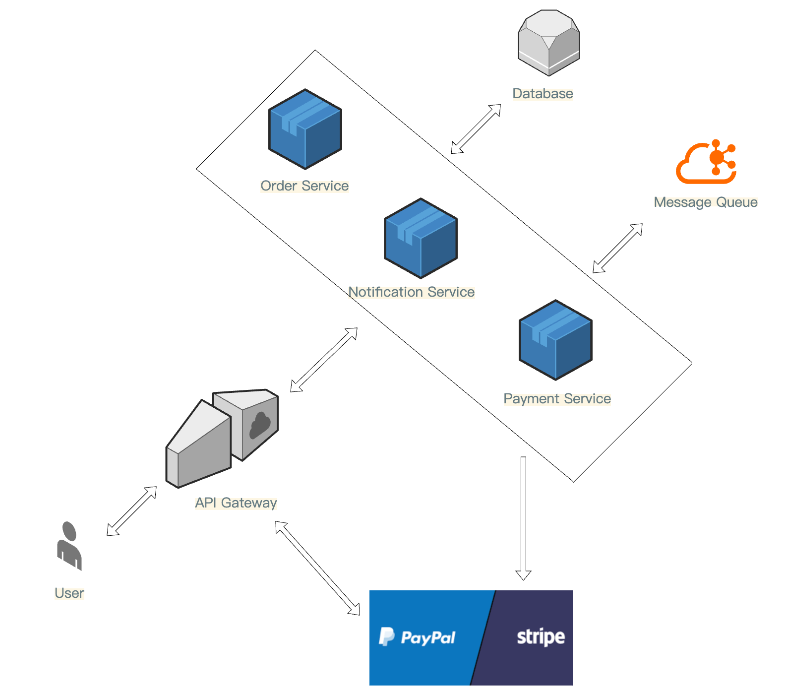

# FusionXPay System Architecture

## 1. Architectural Overview

### Goal:
Provide a secure, scalable, and modular payment gateway that supports multiple providers (e.g., Stripe, PayPal) through a single API. The architecture should accommodate enterprise-level requirements such as robust logging, transaction auditing, idempotent callbacks, and future PCI-DSS alignment.

### Core Characteristics:
1. **Microservices-Based**: Each major function (Order Management, Payment Handling, Notifications) is encapsulated in its own service for independent deployment and scaling.
2. **Cloud-Native & Containerized**: Services run in Docker containers and can be orchestrated by Kubernetes.
3. **Asynchronous Communication**: A message queue (Kafka) decouples services, enabling elasticity and resilience to spikes.
4. **Security & Compliance Focus**: HMAC signatures or tokens for callback validation, enforced HTTPS, secure secrets management, and logging for compliance.
5. **Observability**: Monitoring, logging, and tracing integrated from the outset to ensure quick root-cause analysis and performance tuning.

## 2. High-Level Architecture Diagram

Below is a conceptual diagram incorporating enterprise requirements such as end-to-end transaction management, robust security checks, and centralized logging.

### Components:
- **API Gateway**: Handles request routing, authentication, and security policies.
- **Order Service**: Manages order lifecycle and persistence.
- **Payment Service**: Interfaces with payment providers, processes callbacks.
- **Notification Service**: Push notifications based on order status.
- **Message Queue**: Ensures async processing and decouples services.
- **Databases & Cache**: Persistent storage and caching mechanisms.
- **Monitoring & Logging**: Observability stack for real-time analysis.

## 3. Microservices Breakdown

### 3.1 API Gateway
- **Tech**: Spring Cloud Gateway
- **Responsibilities**:
  - Routes external requests (e.g., `/order/create`, `/payment/callback`) to internal services.
  - Implements rate-limiting, authentication, and IP whitelisting.
  - Logs request metadata for audits (request time, user ID, correlation ID).

### 3.2 Order Service
- **Endpoints**:
  - `POST /order/create` – Creates a new order, sets status to `NEW`.
  - `GET /order/{id}` – Retrieves order status and details.
- **Functionality**:
  - Manages order lifecycle transitions (NEW → PROCESSING → SUCCESS/FAILED).
  - Stores order data in MySQL/PostgreSQL with ACID transactions.
  - Publishes events (e.g., `ORDER_CREATED`, `ORDER_UPDATED`) to the message queue.

### 3.3 Payment Service
- **Endpoints**:
  - `POST /payment/request` – Initiates a payment (if required).
  - `POST /payment/callback` – Processes asynchronous notifications from payment providers.
- **Functionality**:
  - Integrates with external payment APIs using Strategy/Adapter pattern.
  - Ensures callback authenticity (HMAC, tokens), idempotency, and status updates.
  - Publishes messages (`PAYMENT_SUCCESS`) for Order Service to finalize orders.

### 3.4 Notification Service (Optional)
- **Trigger**: Consumes `ORDER_STATUS_CHANGED` messages.
- **Functionality**:
  - Push notifications.
  - Logs notifications for traceability.

## 4. Security & Compliance Measures
- **Mandatory HTTPS/TLS**: Enforces secure communication.
- **HMAC or Token-Based Validation**: Protects against tampering and replay attacks.
- **PCI-DSS Considerations**: Architecture supports future compliance with tokenization options.

## 5. Deployment & DevOps Pipeline

### 5.1 CI/CD Workflow
1. **Source Control**: Git-based branching, PRs, code reviews.
2. **Build & Test**: Maven/Gradle + GitHub Actions/Jenkins.
3. **Containerization**: Each service runs in Docker.
4. **Deployment**:
   - Staging: Docker Compose / Minikube.
   - Production: Kubernetes with Helm.
   - Rolling updates for zero downtime.

### 5.2 Environments
- **Local**: Docker Compose for development.
- **Staging**: Kubernetes cluster for integration testing.
- **Production**: Auto-scaled Kubernetes with redundancy.

## 6. Data Model (Simplified)

### Order Table
| Column       | Type       | Description             |
|-------------|-----------|-------------------------|
| orderId     | UUID      | Unique identifier       |
| amount      | Decimal   | Order amount            |
| currency    | String    | Currency code           |
| status      | Enum      | NEW, PROCESSING, SUCCESS, FAILED |
| createdAt   | Timestamp | Order creation time     |

### PaymentTransaction Table
| Column       | Type       | Description             |
|-------------|-----------|-------------------------|
| transactionId | UUID      | Payment transaction ID |
| orderId     | UUID      | Associated order ID    |
| status      | Enum      | INITIATED, SUCCESS, FAILED |

## 7. Concurrency & Reliability Enhancements
- **Message Queue**: Decouples processing logic.
- **Idempotent Callbacks**: Prevents duplicate status updates.
- **Distributed Locking (Redis)**: Avoids race conditions.
- **Circuit Breakers (Resilience4j)**: Handles external downtime.
- **Retries & DLQs**: Ensures reliable event processing.

## 8. Final Recommendations
- Enhance **security** with tokenization & pen testing.
- Expand **payment providers** via Strategy pattern.
- Implement **real-time monitoring** dashboards.
- Plan for **geo-distributed deployment** if needed.

## Conclusion
FusionXPay’s microservices architecture ensures scalability, security, and reliability while allowing for future expansion. This approach balances compliance needs with flexibility, positioning the platform for enterprise-grade payment processing.

