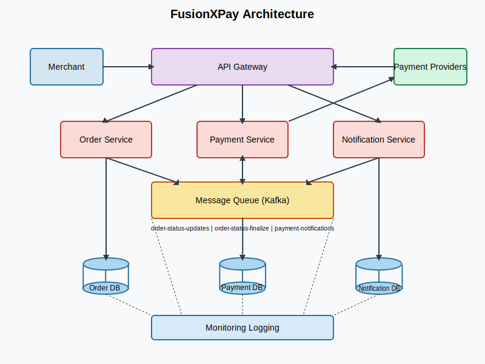

# FusionXPay System Architecture

## 1. Architectural Overview

### Goal:
Provide a secure, scalable, and modular payment gateway that supports multiple providers (e.g., Stripe, PayPal) through a single API. The architecture should accommodate enterprise-level requirements such as robust logging, transaction auditing, idempotent callbacks, and future PCI-DSS alignment.

### Core Characteristics:
1. **Microservices-Based**: Each major function (Order Management, Payment Handling, Notifications) is encapsulated in its own service for independent deployment and scaling.
2. **Cloud-Native & Containerized**: Services run in Docker containers and can be orchestrated by Kubernetes.
3. **Message-Driven Architecture**: A message queue (Kafka) serves as the backbone for inter-service communication, enabling reliable status updates, notifications, and event-driven processing.
4. **Security & Compliance Focus**: HMAC signatures or tokens for callback validation, enforced HTTPS, secure secrets management, and logging for compliance.
5. **Observability**: Monitoring, logging, and tracing integrated from the outset to ensure quick root-cause analysis and performance tuning.

## 2. High-Level Architecture Diagram

Below is a conceptual diagram incorporating enterprise requirements such as end-to-end transaction management, robust security checks, and centralized logging.

### Components:
- **API Gateway**: Handles request routing, authentication, and security policies.
- **Order Service**: Manages order lifecycle and persistence, subscribes to order status update messages.
- **Payment Service**: Processes payment requests, interfaces with payment providers, handles callbacks, and publishes status update messages.
- **Notification Service**: Subscribes to payment result messages and sends notifications to merchants.
- **Message Queue (Kafka/RabbitMQ)**: Core communication infrastructure that enables reliable, asynchronous message delivery between services.
- **Databases & Cache**: Persistent storage and caching mechanisms.
- **Monitoring & Logging**: Observability stack for real-time analysis.

## 3. Microservices Breakdown

### 3.1 API Gateway
- **Tech**: Spring Cloud Gateway
- **Responsibilities**:
  - Routes external requests (e.g., `/api/orders`, `/api/payment/request/{orderId}`, `/api/payment/callback`) to internal services.
  - Implements rate-limiting, authentication, and IP whitelisting.
  - Logs request metadata for audits (request time, user ID, correlation ID).

### 3.2 Order Service
- **Endpoints**:
  - `POST /api/orders` – Creates a new order, sets status to `NEW`.
  - `GET /api/orders/{orderId}` – Retrieves order status and details.
- **Functionality**:
  - Manages order lifecycle transitions (NEW → PROCESSING → SUCCESS/FAILED).
  - Stores order data in MySQL/PostgreSQL with ACID transactions.
  - Subscribes to order status update messages from Payment Service.
  - Updates order status based on received messages.

### 3.3 Payment Service
- **Endpoints**:
  - `POST /api/payment/request/{orderId}` – Initiates payment for a specific order.
  - `POST /api/payment/callback` – Processes asynchronous notifications from payment providers.
- **Functionality**:
  - Integrates with external payment APIs using Strategy/Adapter pattern.
  - Ensures callback authenticity (HMAC, tokens) and idempotency.
  - Publishes messages:
    - `ORDER_STATUS_UPDATE` for Order Service to update order status to PROCESSING.
    - `ORDER_STATUS_FINALIZE` for Order Service to update to SUCCESS/FAILED.
    - `PAYMENT_RESULT` for Notification Service to send merchant notifications.

### 3.4 Notification Service
- **Trigger**: Subscribes to `PAYMENT_RESULT` messages.
- **Functionality**:
  - Sends notifications to merchants about payment outcomes.
  - Logs notification delivery for traceability.

### 3.5 Message Queue System
- **Tech**: Kafka or RabbitMQ
- **Topics/Queues**:
  - `order-status-updates` - For updating order status to PROCESSING
  - `order-status-finalize` - For updating order status to SUCCESS/FAILED
  - `payment-notifications` - For triggering merchant notifications
- **Properties**:
  - Persistent message storage
  - Delivery guarantees
  - Dead letter queues for failed message processing

## 4. Security & Compliance Measures
- **Mandatory HTTPS/TLS**: Enforces secure communication.
- **HMAC or Token-Based Validation**: Protects against tampering and replay attacks.
- **PCI-DSS Considerations**: Architecture supports future compliance with tokenization options.
- **Message Security**: Secure access to message queue, potentially encrypted payloads for sensitive data.

## 5. Deployment & DevOps Pipeline

### 5.1 CI/CD Workflow
1. **Source Control**: Git-based branching, PRs, code reviews.
2. **Build & Test**: Maven/Gradle + GitHub Actions/Jenkins.
3. **Containerization**: Each service runs in Docker.
4. **Deployment**:
   - Staging: Docker Compose / Minikube.
   - Production: Kubernetes with Helm.
   - Rolling updates for zero downtime.

### 5.2 Environments
- **Local**: Docker Compose for development.
- **Staging**: Kubernetes cluster for integration testing.
- **Production**: Auto-scaled Kubernetes with redundancy.

## 6. Data Model (Simplified)

### Order Table
| Column       | Type       | Description             |
|-------------|-----------|-------------------------|
| orderId     | UUID      | Unique identifier       |
| amount      | Decimal   | Order amount            |
| currency    | String    | Currency code           |
| status      | Enum      | NEW, PROCESSING, SUCCESS, FAILED |
| createdAt   | Timestamp | Order creation time     |
| updatedAt   | Timestamp | Last status update time |

### PaymentTransaction Table
| Column       | Type       | Description             |
|-------------|-----------|-------------------------|
| transactionId | UUID      | Payment transaction ID |
| orderId     | UUID      | Associated order ID    |
| provider    | String    | Payment provider name  |
| status      | Enum      | INITIATED, SUCCESS, FAILED |
| providerRef | String    | Provider reference ID  |
| createdAt   | Timestamp | Transaction creation time |
| updatedAt   | Timestamp | Last status update time |

### Notification Table (Optional)
| Column       | Type       | Description             |
|-------------|-----------|-------------------------|
| notificationId | UUID    | Notification ID        |
| orderId     | UUID      | Associated order ID    |
| type        | String    | Notification type      |
| status      | Enum      | SENT, FAILED, PENDING  |
| createdAt   | Timestamp | Creation time          |

## 7. Concurrency & Reliability Enhancements
- **Message Queue**: Decouples processing logic and enables reliable communication.
- **Idempotent Callbacks**: Prevents duplicate status updates.
- **Distributed Locking (Redis)**: Avoids race conditions.
- **Circuit Breakers (Resilience4j)**: Handles external downtime.
- **Retries & DLQs (Dead Letter Queues)**: Ensures reliable event processing.
- **Message Deduplication**: Prevents duplicate message processing.

## 8. Final Recommendations
- Enhance **security** with tokenization & pen testing.
- Expand **payment providers** via Strategy pattern.
- Implement **real-time monitoring** dashboards.
- Plan for **geo-distributed deployment** if needed.
- Consider **exactly-once delivery semantics** for critical message flows.
- Implement comprehensive **message replay capabilities** for recovery scenarios.

## Conclusion
FusionXPay's message-driven microservices architecture ensures scalability, security, and reliability while allowing for future expansion. The decoupled services communicating via message queues provide flexibility for component updates and failure isolation. This approach balances compliance needs with flexibility, positioning the platform for enterprise-grade payment processing.

