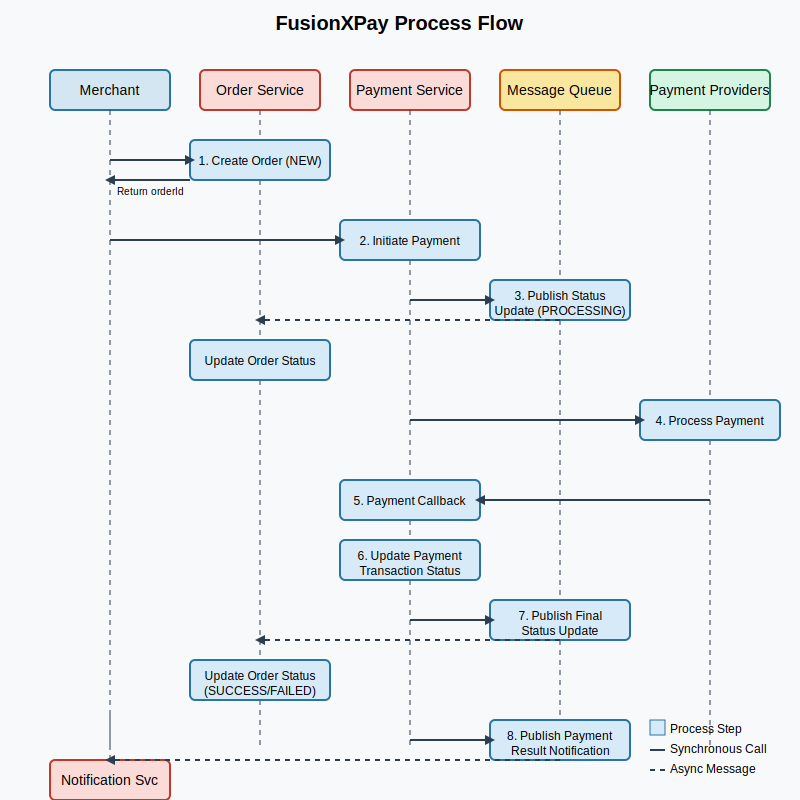

## 1. FusionXPay Process Flow Document

### 1.1 High-Level Overview

1. **Order Creation**: The merchant system calls `/api/orders` with order data. The service responds with a unique `orderId` and sets the order status to `NEW`.
2. **Payment Initiation**: Merchant explicitly calls `/api/payment/request/{orderId}` to initiate payment for the created order.
3. **Order Status Update**: Payment Service sends a message to the Order Service via the message queue to update the order status to `PROCESSING`.
4. **Payment Request**: Payment Service generates a request to the selected gateway and dispatches it to the third-party provider.
5. **Payment Gateway Processing**: The third-party provider asynchronously handles the transaction and notifies FusionXPay via a callback.
6. **Callback Handling**: FusionXPay validates the callback, ensures it is authentic, and updates the payment transaction status.
7. **Order Status Update**: Payment Service sends a message to Order Service via the message queue to update the order status to `SUCCESS` or `FAILED`.
8. **Notification**: Payment Service sends a message to Notification Service via the message queue with payment result information.
9. **Merchant Notification**: Notification Service processes the message and sends a notification to the merchant about the payment result.
10. **Final Logging & Audit**: All activities are recorded, enabling traceability and performance analysis.

### 1.2 Detailed Flow Steps

#### Step 1: Order Creation

- **User Action**: Merchant or client posts to `/api/orders`.
- **System Action**: Validates inputs, creates an order record with status `NEW`, returns `orderId`.

#### Step 2: Payment Initiation

- **User Action**: Merchant calls `/api/payment/request/{orderId}` with payment details.
- **System Action**: Payment Service receives request and prepares for payment processing.

#### Step 3: Order Status Update to Processing

- **System Action**: 
  - Payment Service sends message to message queue.
  - Order Service subscribes to queue, receives message, and updates order status to `PROCESSING`.

#### Step 4: Payment Request Dispatch

- **System Action**: 
  - Payment Service retrieves order details and composes a signed request.
  - Dispatches request to the gateway, logs request data.

#### Step 5: Payment Gateway Processing

- **External Interaction**: Gateway processes payment asynchronously.
- **System Action**: FusionXPay awaits callback for final confirmation.

#### Step 6: Callback Handling

- **External Trigger**: The gateway posts result data to `/api/payment/callback`.
- **System Action**: Payment Service validates signature, checks for duplicates, and updates payment transaction status.

#### Step 7: Order Status Update to Final State

- **System Action**: 
  - Payment Service sends message to message queue with payment result.
  - Order Service subscribes to queue, receives message, and updates order status to `SUCCESS` or `FAILED`.

#### Step 8: Notification Message

- **System Action**: Payment Service sends message to message queue with notification details.

#### Step 9: Merchant Notification

- **System Action**: 
  - Notification Service subscribes to queue, receives message.
  - Sends notification to merchant about payment result.

#### Step 10: Final Logging

- **System Action**: Writes final status to databases, logs entire transaction lifecycle.

### 1.3 Flow Diagram

### 1.4 Additional Considerations

- **Idempotency**: Deduplicate repeated callbacks or requests by referencing order state.
- **Monitoring**: Use tools like Prometheus, ELK stack, or Splunk for system metrics and logs.
- **Message Queue Reliability**: Ensure message delivery guarantees through configurations like persistence and acknowledgment.
- **Security**: Enforce HTTPS, implement robust key management for HMAC or token validation, plan for future compliance (e.g., PCI-DSS).
- **Error Handling**: Standardize responses for partial failures, invalid signatures, or downtime from providers.
