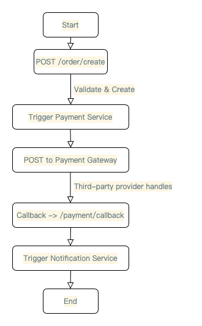

## 1. FusionXPay Process Flow Document

### 1.1 High-Level Overview

1. **Order Creation**: The merchant system calls `/order/create` with order data. The service responds with a unique `orderId` and sets the order status to `NEW`.
2. **Payment Request**: Internal or external trigger instructs the Payment Service to generate a request to the selected gateway. Order status is updated to `PROCESSING`.
3. **Payment Gateway Processing**: The third-party provider asynchronously handles the transaction and notifies FusionXPay via a callback.
4. **Callback Handling**: FusionXPay validates the callback, ensures it is authentic, and updates the order to `SUCCESS` or `FAILED`.
5. **Final Logging & Audit**: All activities are recorded, enabling traceability and performance analysis.

### 1.2 Detailed Flow Steps

#### Step 1: Order Creation

- **User Action**: Merchant or client posts to `/order/create`.
- **System Action**: Validates inputs, creates an order record (`NEW`), returns `orderId`.

#### Step 2: Payment Request Dispatch

- **Internal Trigger**: The Payment Service retrieves order details and composes a signed request.
- **System Action**: Dispatches request to the gateway, logs request data, sets order status to `PROCESSING`.

#### Step 3: Payment Gateway Processing

- **External Interaction**: Gateway processes payment asynchronously.
- **System Action**: FusionXPay awaits callback for final confirmation.

#### Step 4: Callback Handling

- **External Trigger**: The gateway posts result data to `/payment/callback`.
- **System Action**: Validates signature, checks for duplicates, updates order to `SUCCESS` or `FAILED`, and sends acknowledgment.

#### Step 5: Order Status Update & Logging

- **System Action**: Writes final status to the database, logs entire transaction lifecycle, triggers any follow-up notifications.

### 1.3 Flow Diagram

### 1.4 Additional Considerations

- **Idempotency**: Deduplicate repeated callbacks or requests by referencing order state.
- **Monitoring**: Use tools like Prometheus, ELK stack, or Splunk for system metrics and logs.
- **Security**: Enforce HTTPS, implement robust key management for HMAC or token validation, plan for future compliance (e.g., PCI-DSS).
- **Error Handling**: Standardize responses for partial failures, invalid signatures, or downtime from providers.
